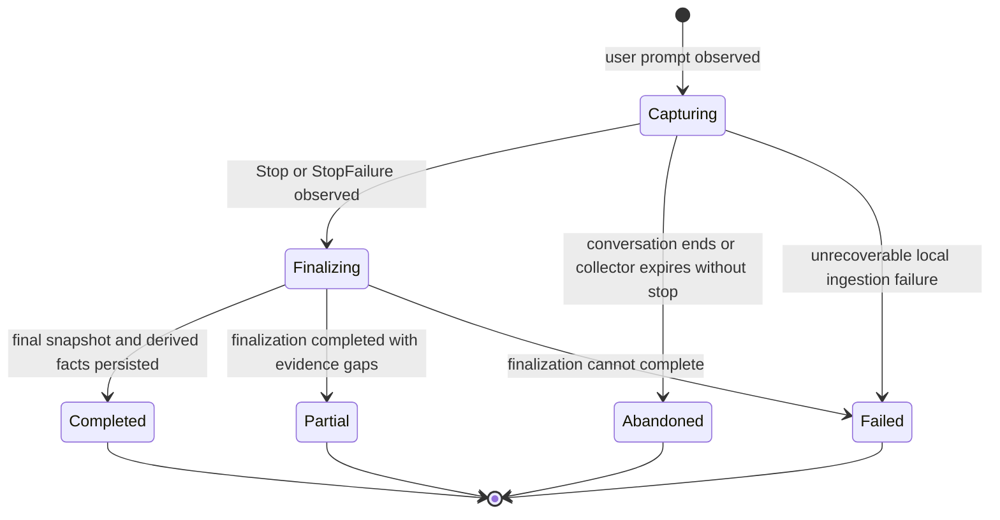

# ADR-0003: Define a Versioned Event Schema and Task-Run Lifecycle

**Status:** Proposed  
**Date:** 2026-07-19  
**Decision owner:** Project founder  
**Related documents:**

- `docs/product/PROJECT_SCOPE.md`
- `docs/adr/0002-local-first-claude-code-first-mvp.md`

---

## Context

OwnLoop must reconstruct a meaningful coding-agent work episode from lifecycle hooks, tool activity, Git state, and verification results.

Claude Code can emit lifecycle events at session, prompt, and tool boundaries. The external agent session may contain multiple user prompts, may be resumed later, and may end without a clean final event. Tool hooks may also be delivered concurrently for parallel tool calls.

A single undifferentiated `session` model would make the following difficult:

- producing a replay for one user task;
- ordering concurrent tool activity;
- distinguishing a resumed conversation from a new task;
- retrying hook delivery safely;
- detecting missing or contradictory evidence;
- evolving the event model without rewriting original data.

OwnLoop therefore needs explicit internal boundaries and a versioned append-only event envelope.

---

## Decision

OwnLoop will model coding-agent activity using four primary records:

1. **Workspace** — the selected local Git repository.
2. **Agent Conversation** — the external Claude Code session identified by its source session ID.
3. **Task Run** — one user task or prompt episode that OwnLoop analyzes and replays.
4. **Event** — one append-only observed or derived fact associated with a conversation and, when known, a task run.

A Build Replay is produced for a **Task Run**, not for an entire long-lived Claude conversation.

---

## Aggregate relationships

```text
Workspace
└── Agent Conversation
    ├── Task Run 1
    │   ├── Event 1
    │   ├── Event 2
    │   └── Evidence / Moments / Replay
    ├── Task Run 2
    │   └── ...
    └── Conversation-level events
```

### Workspace

Represents one local Git working tree.

Required fields:

- `workspaceId`
- canonical local path
- repository root
- Git remote when available
- initial repository fingerprint
- created and last-observed timestamps

### Agent Conversation

Represents one source-agent conversation or session.

Required fields:

- `conversationId`
- `workspaceId`
- `source`
- `sourceSessionId`
- start mode such as startup or resume when known
- started, last-observed, and ended timestamps
- status

### Task Run

Represents one user-directed work episode.

A Task Run normally begins on `UserPromptSubmit`. A continuation prompt creates a new Task Run under the same Agent Conversation unless OwnLoop can establish that it is a direct answer to an unresolved agent question. That exception is deferred from v0.1; the MVP creates a new run for every submitted user prompt and may later support run merging.

Required fields:

- `runId`
- `conversationId`
- sequential run number within the conversation
- original prompt or its redacted form
- baseline Git commit and working-tree fingerprint
- start and end timestamps
- lifecycle status
- final Git fingerprint
- source stop reason when known
- completeness and evidence-gap indicators

---

## Task Run state machine



### Capturing

The task is active and source events may still arrive.

### Finalizing

No more normal agent actions are expected. OwnLoop captures the final repository state, computes the Git diff, associates test and build observations, and validates event completeness.

### Completed

The run has a baseline, final snapshot, diff, and sufficient event continuity for replay generation.

### Partial

A replay may be generated, but at least one expected source or derived artifact is missing or inconsistent.

### Abandoned

The task did not produce a normal stop boundary and timed out or the conversation ended unexpectedly.

### Failed

OwnLoop could not retain a reliable minimum run record. Agent execution itself remains unaffected.

---

## Normalized event envelope

All source events are normalized into the following logical envelope:

```json
{
  "eventId": "01J2Y6P8R3A4B5C6D7E8F9G0H1",
  "schemaVersion": 1,
  "workspaceId": "wsp_01J2Y6",
  "conversationId": "con_01J2Y7",
  "runId": "run_01J2Y8",
  "sequence": 42,
  "type": "tool.succeeded",
  "source": "claude_code",
  "sourceEventName": "PostToolUse",
  "sourceEventId": "toolu_01ABC123",
  "occurredAt": "2026-07-19T12:34:56.000Z",
  "ingestedAt": "2026-07-19T12:34:56.083Z",
  "sensitivity": "normal",
  "payload": {},
  "metadata": {
    "collectorVersion": "0.1.0",
    "sourceVersion": null
  }
}
```

### Required envelope properties

- `eventId` uses a sortable unique identifier such as ULID.
- `schemaVersion` versions the normalized event contract.
- `sequence` is assigned transactionally per Task Run.
- `occurredAt` is the best known source timestamp.
- `ingestedAt` is generated by OwnLoop.
- `sourceEventId` is retained when the source provides one.
- `payload` contains only the normalized event-specific data required by OwnLoop.
- `sensitivity` supports redaction and model-routing decisions.

---

## Initial internal event taxonomy

### Conversation events

- `conversation.started`
- `conversation.resumed`
- `conversation.ended`

### Run events

- `run.started`
- `run.stop_observed`
- `run.stop_failed`
- `run.finalization_started`
- `run.completed`
- `run.partial`
- `run.abandoned`
- `run.failed`

### User and plan events

- `user.prompt_submitted`
- `agent.plan_observed`
- `agent.summary_observed`

### Tool events

- `tool.requested`
- `tool.succeeded`
- `tool.failed`
- `tool.batch_completed`

### File events

- `file.read_observed`
- `file.write_requested`
- `file.created`
- `file.modified`
- `file.deleted`
- `file.change_observed`

### Command events

- `command.started`
- `command.completed`
- `command.failed`

### Verification events

- `test.observed`
- `build.observed`
- `lint.observed`
- `typecheck.observed`

### Git and snapshot events

- `snapshot.baseline_captured`
- `snapshot.final_captured`
- `git.diff_computed`
- `git.commit_observed`

### Data-quality events

- `evidence.gap_detected`
- `event.duplicate_ignored`
- `event.source_unrecognized`
- `redaction.applied`

Derived facts, evidence references, Ownership Moments, and Build Replays are stored in separate tables and are not represented as immutable source observations unless their generation itself must be audited later.

---

## Claude Code hook mapping for v0.1

The adapter will initially consume a conservative subset of documented Claude Code lifecycle events:

| Claude Code hook | OwnLoop use |
|---|---|
| `SessionStart` | create or resume Agent Conversation; capture workspace and session metadata |
| `UserPromptSubmit` | create Task Run; record original prompt and baseline snapshot request |
| `PreToolUse` | record tool request and requested file or command operation |
| `PostToolUse` | record successful tool result and schedule repository reconciliation |
| `PostToolUseFailure` | record failed tool result |
| `PostToolBatch` | close a parallel tool batch and trigger one reconciliation pass |
| `Stop` | begin Task Run finalization |
| `StopFailure` | begin failed or partial finalization |
| `SessionEnd` | close the Agent Conversation and abandon any stale active runs |

Additional events such as `FileChanged`, `TaskCreated`, `TaskCompleted`, and subagent events may be adopted later after controlled observation demonstrates a stable need.

The adapter must tolerate fields being added, removed, or changed by the source. Unknown source fields are ignored unless raw-event retention is explicitly enabled.

---

## Tool-event normalization

Tool names are normalized to a small internal operation set while preserving the original tool name.

Examples:

| Source tool | Internal operation |
|---|---|
| `Read` | `file.read` |
| `Write` | `file.write` |
| `Edit` | `file.edit` |
| `Bash` | `command.execute` |
| `Glob` | `workspace.search` |
| `Grep` | `workspace.search` |
| MCP tool | `external_tool.execute` |

The internal event records what was requested and what the tool reported. Actual repository state is established by filesystem and Git reconciliation rather than by trusting the tool description alone.

---

## Ordering and concurrency

Claude Code may execute parallel tool calls. Hook arrival order is not assumed to be identical to semantic execution order.

OwnLoop will:

1. retain source timestamps and tool-use identifiers;
2. assign an ingestion sequence transactionally;
3. link request and result events by `sourceEventId` or tool-use ID;
4. use `PostToolBatch` as a batch boundary when available;
5. order replay narratives using causal links first, source time second, and ingestion sequence last;
6. avoid claiming exact ordering when causal evidence is insufficient.

The `sequence` field guarantees storage order, not perfect causal order.

---

## Idempotency and duplicate handling

Hook delivery and local retries may produce duplicate observations.

Every inbound event receives a deterministic `deduplicationKey` derived from the best available stable fields:

```text
source
+ sourceSessionId
+ hookEventName
+ toolUseId when present
+ normalized payload fingerprint
```

If the same key is received again:

- the original event remains unchanged;
- the duplicate is not appended as a normal event;
- a diagnostic counter is incremented;
- an optional `event.duplicate_ignored` diagnostic may be recorded outside the run stream.

Idempotency must not rely only on timestamps.

---

## Repository reconciliation

Tool events are not sufficient proof of actual file state.

OwnLoop performs repository reconciliation at the following boundaries:

- after `UserPromptSubmit` for the baseline;
- after a completed tool batch when file or command operations occurred;
- on `Stop` or `StopFailure`;
- during recovery when an incomplete run is discovered.

Reconciliation computes:

- current Git status;
- created, modified, and deleted paths;
- staged and unstaged changes;
- binary-file changes;
- repository fingerprint;
- diff or diff references according to size limits.

File change events derived from reconciliation are marked with `source: "ownloop"` and link back to the tool or batch that triggered the scan when possible.

---

## Baseline policy

A Task Run baseline consists of:

- current HEAD commit;
- staged diff fingerprint;
- unstaged diff fingerprint;
- untracked file inventory and hashes subject to size and sensitivity rules.

OwnLoop does not require a clean working tree. Pre-existing changes are recorded as baseline state and excluded from the run diff when possible.

If the baseline cannot be captured reliably, the run may continue but must be marked `Partial`, and no claim may state that every displayed change was created by the current agent run.

---

## Data sensitivity and redaction

Redaction occurs before persistence of optional raw source payloads and before any external model call.

Initial sensitivity classes:

- `public`
- `normal`
- `sensitive`
- `secret`

Known secret sources include:

- `.env` and variants;
- private keys and credential files;
- values matching configured secret patterns;
- token-like values detected by deterministic scanners.

For secret content:

- retain path and event metadata when safe;
- do not persist the secret value;
- replace content with a stable redaction marker;
- never send it to an external model.

---

## Raw source payload policy

The normalized event is the required source of record.

Raw Claude hook payload storage is disabled by default in v0.1. A development-only diagnostic mode may retain redacted raw payloads with:

- explicit user opt-in;
- a short retention period;
- a clear visual indicator;
- complete deletion support.

This prevents the core data model from depending on unstable source-specific structures.

---

## Evidence gaps and partial runs

OwnLoop must communicate uncertainty explicitly.

Examples of evidence gaps:

- missing baseline;
- missing final snapshot;
- tool request without result;
- command executed without available output;
- repository change with no associated tool event;
- test claim without observed test execution;
- truncated diff;
- collector downtime.

Evidence gaps are stored as structured records and may prevent a candidate moment from being validated.

A Partial run may still produce a replay, but the replay must identify its limitations.

---

## Recovery behavior

On local daemon startup, OwnLoop scans for Task Runs in `Capturing` or `Finalizing` states.

For each stale run it will:

1. verify whether the source conversation is still active when possible;
2. capture the current repository snapshot;
3. compare it with the stored baseline;
4. mark missing boundaries as evidence gaps;
5. finalize as `Partial` or `Abandoned` rather than silently deleting it.

Recovery must not invoke or resume the coding agent automatically.

---

## Storage constraints

- Event insertion and sequence assignment occur in one SQLite transaction.
- Events are append-only.
- Large diffs and command outputs may be stored as content-addressed artifacts referenced by events.
- Artifact hashes use a modern cryptographic digest.
- Derived tables include a `generatorVersion` so outputs can be regenerated and compared.
- Schema migrations must preserve original normalized events or provide an explicit event-upcast path.

---

## Versioning

### Event schema

`schemaVersion` is an integer incremented for breaking envelope or payload changes.

Readers must either:

- understand the stored version directly; or
- apply a deterministic upcaster to the current in-memory representation.

Original stored events are not rewritten merely to match a new application version.

### Taxonomy

Event type names are stable contracts. Renaming an event type is a breaking schema change.

Adding optional payload fields is backward compatible. Removing or changing meaning is breaking.

---

## Observability

The collector records operational metrics without source-code content:

- hook events received;
- accepted and duplicate events;
- processing latency;
- reconciliation duration;
- artifact size;
- redaction count;
- dropped or malformed event count;
- run finalization outcome.

Operational logs must not include raw prompts, code, diffs, or secrets by default.

---

## Alternatives considered

### One session equals one Claude conversation

Rejected because a conversation can contain multiple prompts, resumed work, and unrelated tasks. Replays and ownership records require a smaller task boundary.

### Mutable session snapshot only

Rejected because it prevents reliable replay, analyzer reprocessing, and diagnosis of missing events.

### Trust tool events as file-change truth

Rejected because commands and external tools may modify files indirectly, while reported tool intent may differ from actual repository state.

### Persist every raw hook payload

Rejected as the default because source schemas are unstable and raw payloads increase privacy, storage, and migration risk.

### Use timestamps as the sole ordering mechanism

Rejected because parallel tools, clock resolution, and delivery delays make timestamps insufficient for deterministic storage and causal reconstruction.

---

## Consequences

### Positive

- Replays align with one user task rather than a long conversation.
- Source-specific instability is isolated in the adapter.
- Duplicate delivery is safe.
- Parallel tool calls can be represented without false precision.
- Actual Git state is distinguished from reported tool actions.
- Partial and incomplete evidence is explicit.
- Analyzer improvements can reprocess historical runs.

### Negative

- The model is more complex than a single session table.
- Correct baseline handling with pre-existing changes requires careful implementation.
- Content-addressed artifacts and upcasters add engineering work.
- Source hook behavior may still leave unavoidable evidence gaps.
- Mapping continuation prompts to separate Task Runs may split some logically continuous work in v0.1.

---

## Implementation constraints

The first vertical slice must implement only:

- Workspace;
- Agent Conversation;
- Task Run;
- Event envelope;
- the conservative hook subset listed above;
- baseline and final Git reconciliation;
- duplicate handling;
- partial-run recovery.

Ownership Moment generation must not be implemented until this slice can capture and replay a controlled Task Run deterministically.

---

## References

- Claude Code hooks reference: <https://code.claude.com/docs/en/hooks>
- Claude Code hooks guide: <https://code.claude.com/docs/en/hooks-guide>

These are external evolving interfaces. The adapter must be integration-tested against the supported Claude Code version rather than relying only on documentation assumptions.
