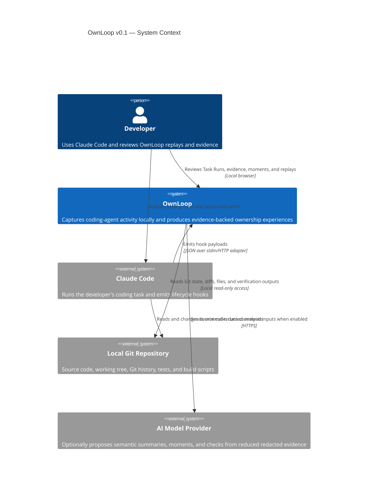
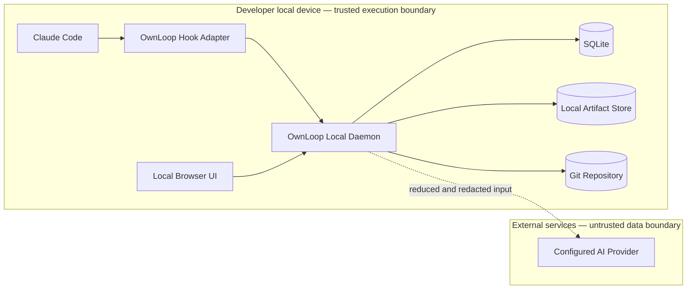
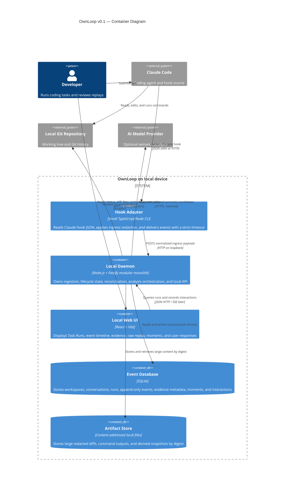
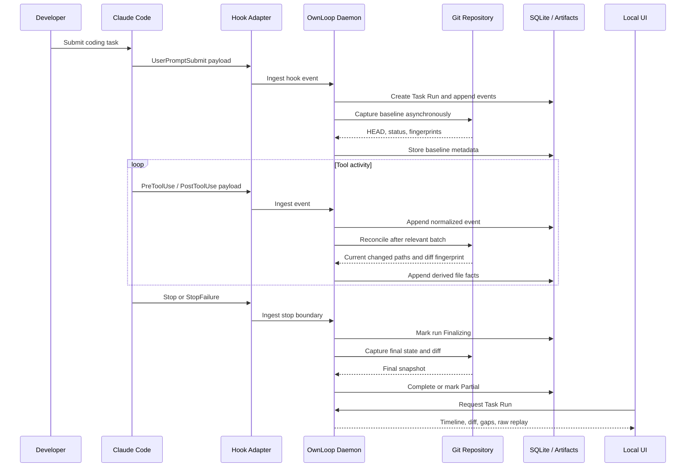
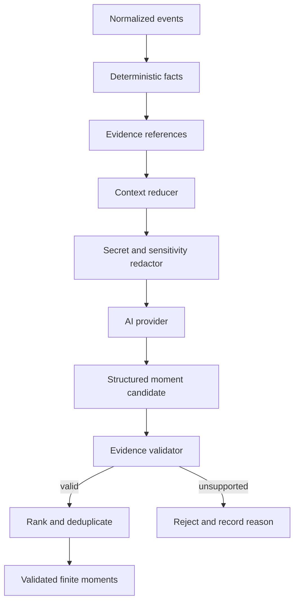

# OwnLoop v0.1 — C4 Architecture Model

**Status:** Proposed  
**Date:** 2026-07-19  
**Scope:** Local single-user technical prototype  
**Related ADRs:** ADR-0001, ADR-0002, ADR-0003

---

## 1. Architecture objective

The v0.1 architecture must capture and reconstruct a real Claude Code Task Run without entering the coding agent's critical path, uploading the full repository, or requiring a hosted backend.

The first vertical slice is successful when a user prompt can be traced through source hook events to a baseline snapshot, tool activity, a final Git diff, and a deterministic raw replay.

Ownership Moment generation is intentionally downstream from reliable event capture.

---

## 2. C4 Level 1 — System context



### System responsibilities

OwnLoop is responsible for:

- receiving and normalizing supported Claude Code hook events;
- separating external conversations from internal Task Runs;
- capturing baseline and final repository state;
- deriving evidence from Git and deterministic analyzers;
- exposing incomplete or contradictory evidence;
- generating a finite replay;
- optionally proposing semantic explanations and Ownership Moments;
- recording user interaction with evidence and moments.

OwnLoop is not responsible in v0.1 for:

- controlling Claude Code permissions;
- writing source code;
- pausing, blocking, or redirecting the agent;
- hosting repositories;
- team accounts, cloud synchronization, or organization governance.

---

## 3. Trust boundaries



### Boundary rules

- Raw source code, complete repository content, and unfiltered transcripts remain local by default.
- The model provider is optional for capture and raw replay.
- Secret redaction occurs before persistence of optional raw payloads and before external requests.
- The browser UI binds to loopback only in v0.1.
- The local daemon has read-only application intent toward the repository; any temporary files created by OwnLoop must live outside the analyzed workspace.
- Hook failure is fail-open for the coding agent.

---

## 4. C4 Level 2 — Containers



---

## 5. Container responsibilities

## 5.1 Hook Adapter

The adapter is intentionally small and disposable.

Responsibilities:

- read one Claude Code hook payload;
- add adapter version and receipt metadata;
- perform mandatory path and secret-field redaction;
- send the event to the loopback daemon with a short timeout;
- optionally write a bounded local spool item if the daemon is temporarily unavailable;
- exit without blocking Claude Code in observation mode.

The adapter must not:

- analyze source semantics;
- call an external model;
- compute a full repository diff;
- mutate the repository;
- contain business rules for Ownership Moments.

### Failure behavior

- A collector timeout or connection failure is logged locally.
- The adapter exits successfully unless the hook contract itself requires otherwise.
- An optional spool must have size, age, and sensitivity limits.

---

## 5.2 Local Daemon

The daemon is a modular monolith for v0.1.

Logical modules:

```text
HTTP Ingestion
Event Normalization
Run Lifecycle
Idempotency and Sequencing
Repository Reconciliation
Artifact Management
Deterministic Analysis
Semantic Analysis Gateway
Moment Validation and Ranking
Replay Projection
Local Query API
Recovery and Diagnostics
```

A single process is selected to reduce deployment, IPC, logging, and debugging overhead for a one-person team.

Internal modules communicate through typed application interfaces rather than a distributed message broker.

### Critical-path rule

Ingestion must acknowledge quickly after durable local persistence. Expensive reconciliation and analysis run after ingestion through a local job table or in-process worker queue.

---

## 5.3 Local Web UI

Initial routes:

```text
/                       recent Task Runs
/runs/:runId            Task Run overview
/runs/:runId/events     normalized event timeline
/runs/:runId/diff       baseline-to-final diff
/runs/:runId/replay     raw and later enriched Build Replay
/settings               local privacy and provider settings
/diagnostics            collector and evidence-gap diagnostics
```

The first UI milestone renders only:

- Task Run status;
- prompt;
- timeline;
- changed files;
- final diff;
- evidence gaps;
- raw replay.

Ownership Moments are added only after this representation is reliable.

---

## 5.4 SQLite event database

Initial logical tables:

```text
workspaces
agent_conversations
task_runs
events
event_deduplication
artifacts
evidence
evidence_gaps
analysis_jobs
moment_candidates
moments
user_interactions
replay_projections
schema_migrations
```

Key constraints:

- `(run_id, sequence)` is unique.
- normalized events are append-only at the application layer.
- source deduplication keys are unique within a source session.
- derived records include generator and schema versions.
- deletion cascades must support full local session deletion.

---

## 5.5 Artifact store

Large content should not be duplicated inside SQLite rows.

Artifacts may include:

- baseline and final diff payloads;
- large command outputs;
- reduced source excerpts;
- redacted optional raw hook payloads in diagnostic mode;
- generated replay snapshots.

Artifacts are:

- addressed by cryptographic digest;
- immutable after creation;
- referenced from database metadata;
- deleted when no retained record references them;
- stored outside the analyzed repository.

---

## 6. Main runtime sequence



---

## 7. Data flow for semantic analysis

Semantic analysis is optional and downstream.



The model never receives unrestricted repository access through OwnLoop v0.1.

---

## 8. Deployment view

```text
Developer workstation
├── Claude Code
├── Git
├── Node.js runtime
├── OwnLoop hook CLI
├── OwnLoop local daemon
├── OwnLoop React static assets
├── OwnLoop SQLite database
└── OwnLoop artifact directory
```

No container runtime is required for v0.1.

Supported operating-system priority:

1. the founder's active development environment;
2. macOS and Linux;
3. Windows through a separately tested path after the first vertical slice.

Cross-platform support is not considered complete until the hook, Git, path normalization, process lifecycle, and browser launch behaviors are tested on the target platform.

---

## 9. Security model for v0.1

### Local API

- Bind to `127.0.0.1` only.
- Generate a local installation token for hook ingestion.
- Reject requests without the token.
- Apply request size limits.
- Validate all payloads using a runtime schema.
- Never accept arbitrary file paths from the browser without workspace containment checks.

### Repository access

- Canonicalize all paths.
- Reject traversal outside the registered workspace.
- Do not execute source-provided scripts as part of analysis.
- Git commands must use fixed argument arrays rather than interpolated shell strings.

### External AI

- Disabled until configured.
- BYOK in v0.1.
- Minimal reduced input.
- Deterministic redaction before requests.
- No full transcript or repository upload.
- Persist request metadata and cost estimate without logging secret content.

---

## 10. Architectural fitness checks

The implementation should continuously verify:

1. hook delivery failure does not stop Claude Code;
2. every displayed claim resolves to retained evidence;
3. source events cannot be updated through normal application APIs;
4. external model analysis can be disabled without breaking raw replay;
5. no analyzed path escapes the registered workspace;
6. Task Runs can be reconstructed after daemon restart;
7. duplicate hook delivery does not duplicate normal events;
8. pre-existing working-tree changes are not silently attributed to the current run;
9. local API is not exposed beyond loopback;
10. deleting a run removes its unreferenced artifacts.

---

## 11. Deferred architecture decisions

The following need separate ADRs after the capture vertical slice:

- process lifecycle and installation model;
- SQLite library and migration strategy;
- Git baseline algorithm for dirty working trees;
- artifact retention and deletion policy;
- AI provider abstraction and structured-output contract;
- TypeScript semantic analyzer choice;
- live updates with Server-Sent Events versus polling;
- VS Code integration;
- cloud and team synchronization.

---

## 12. Architecture validation order

The system must be validated in this sequence:

1. Hook Adapter receives and safely forwards supported events.
2. Local Daemon appends idempotent normalized events.
3. Task Run lifecycle survives restart and incomplete delivery.
4. Baseline and final Git reconciliation produce a trustworthy run diff.
5. Local UI renders a deterministic raw replay.
6. Deterministic analyzers produce evidence.
7. AI proposes structured candidate moments.
8. Evidence validation rejects unsupported candidates.
9. Finite moments and enriched replay are shown.

Skipping directly to step 7 would create an attractive interface on an unreliable evidence foundation and is prohibited by the current scope.
