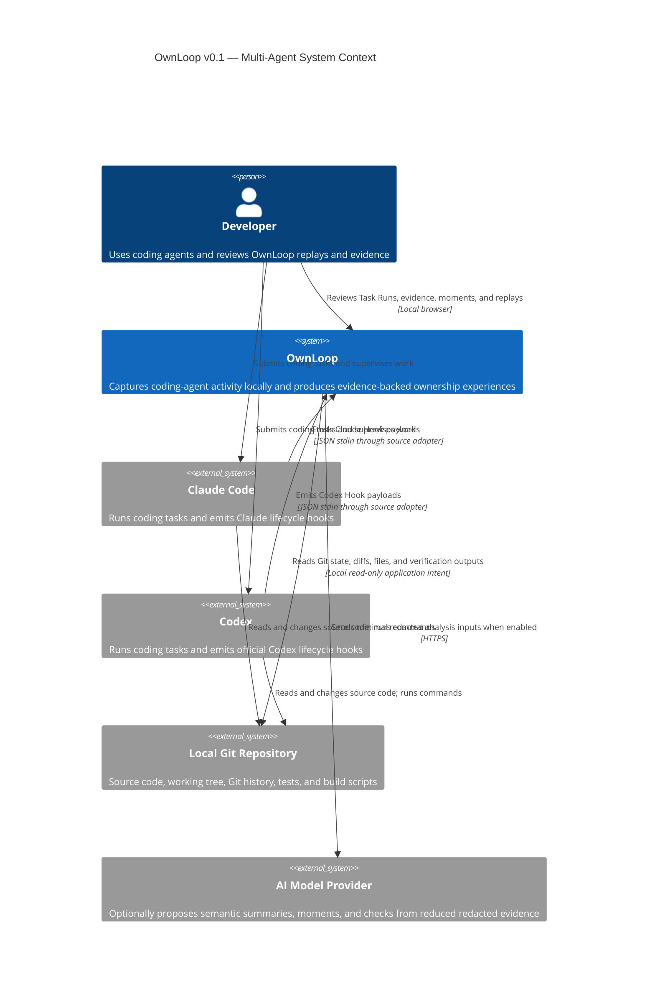
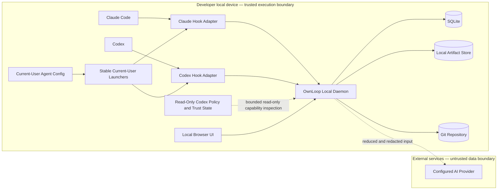
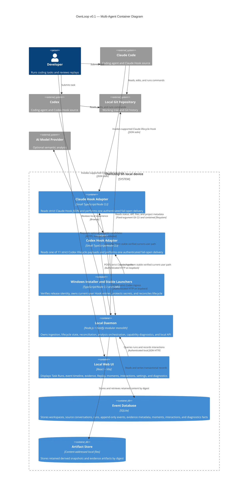
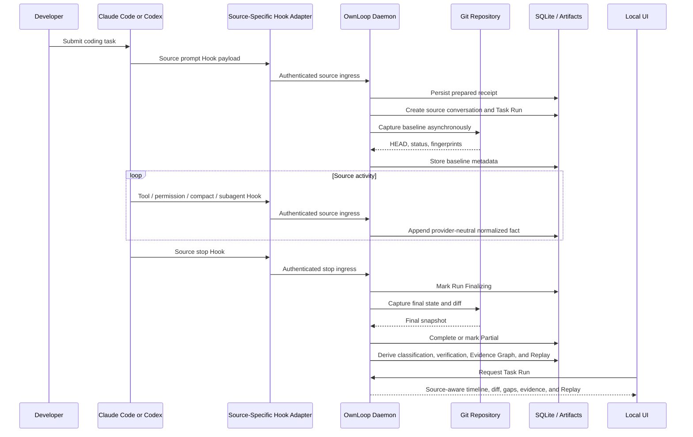
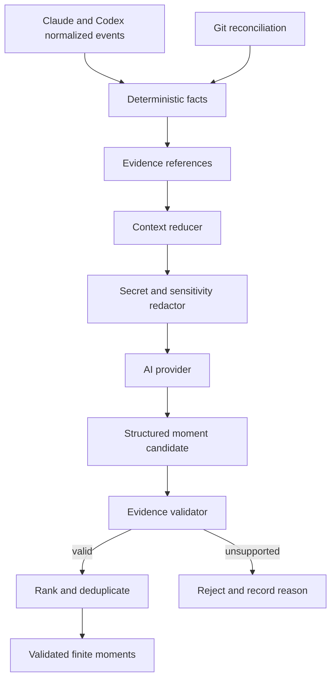

# OwnLoop v0.1 — C4 Architecture Model

**Status:** Implemented local runtime; Codex real-client certification pending  
**Date:** 2026-08-01  
**Scope:** Local single-user technical prototype on Windows  
**Related ADRs:** ADR-0001, ADR-0002, ADR-0003, ADR-0027, ADR-0028, ADR-0029

---

## 1. Architecture objective

The v0.1 architecture captures and reconstructs a real coding-agent Task Run without entering the coding agent's critical path, uploading the full repository, or requiring a hosted backend.

Claude Code and Codex remain separate source boundaries. Each source has a strict fail-open adapter and source-specific ingress contract. After durable preparation and normalization, both sources enter the same provider-neutral Task Run, Git reconciliation, evidence, Replay, and Ownership pipeline.

The vertical slice is successful when a user prompt can be traced through controlled source Hook events to a baseline snapshot, source activity, a final Git diff, deterministic verification evidence, and a finite Replay. Source events remain observations. Git and deterministic analyzers remain the evidence authorities.

Ownership Moment generation is intentionally downstream from reliable event capture.

---

## 2. C4 Level 1 — System context


```mermaid
C4Context
    title OwnLoop v0.1 — Multi-Agent System Context

    Person(developer, "Developer", "Uses coding agents and reviews OwnLoop replays and evidence")

    System(ownloop, "OwnLoop", "Captures coding-agent activity locally and produces evidence-backed ownership experiences")
    System_Ext(claude, "Claude Code", "Runs coding tasks and emits Claude lifecycle hooks")
    System_Ext(codex, "Codex", "Runs coding tasks and emits official Codex lifecycle hooks")
    System_Ext(repo, "Local Git Repository", "Source code, working tree, Git history, tests, and build scripts")
    System_Ext(provider, "AI Model Provider", "Optionally proposes semantic summaries, moments, and checks from reduced redacted evidence")

    Rel(developer, claude, "Submits coding tasks and supervises work")
    Rel(developer, codex, "Submits coding tasks and supervises work")
    Rel(claude, repo, "Reads and changes source code; runs commands")
    Rel(codex, repo, "Reads and changes source code; runs commands")
    Rel(claude, ownloop, "Emits Claude Hook payloads", "JSON stdin through source adapter")
    Rel(codex, ownloop, "Emits Codex Hook payloads", "JSON stdin through source adapter")
    Rel(ownloop, repo, "Reads Git state, diffs, files, and verification outputs", "Local read-only application intent")
    Rel(developer, ownloop, "Reviews Task Runs, evidence, moments, and replays", "Local browser")
    Rel(ownloop, provider, "Sends minimal redacted analysis inputs when enabled", "HTTPS")
```

### System responsibilities

OwnLoop is responsible for:

- receiving and validating supported Claude Code and Codex Hook events through isolated source contracts;
- separating external source conversations from internal Task Runs;
- retaining explicit source identity, version, surface, turn, tool, and subagent facts only when supplied and accepted;
- capturing baseline and final repository state;
- deriving evidence from Git and deterministic analyzers;
- exposing incomplete, unverified, or contradictory source coverage;
- generating a finite Replay;
- optionally proposing semantic explanations and Ownership Moments;
- recording user interaction with evidence and moments;
- reporting Codex installation, trust, managed-policy, event-coverage, and client-surface capability without bypassing the agent.

OwnLoop is not responsible in v0.1 for:

- controlling Claude Code or Codex permissions;
- writing source code;
- pausing, blocking, rewriting, or redirecting either agent;
- forging Codex Hook trust or modifying managed policy;
- reading Codex transcript or rollout/session history;
- hosting repositories;
- team accounts, cloud synchronization, or organization governance.

---

## 3. Trust boundaries


```mermaid
flowchart LR
    subgraph LocalDevice[Developer local device — trusted execution boundary]
        CC[Claude Code]
        CX[Codex]
        CH[Claude Hook Adapter]
        XH[Codex Hook Adapter]
        CL[Stable Current-User Launchers]
        Daemon[OwnLoop Local Daemon]
        DB[(SQLite)]
        Artifacts[(Local Artifact Store)]
        Repo[(Git Repository)]
        Browser[Local Browser UI]
        Config[Current-User Agent Config]
        Policy[Read-Only Codex Policy and Trust State]
    end

    subgraph External[External services — untrusted data boundary]
        AI[Configured AI Provider]
    end

    CC --> CH
    CX --> XH
    Config --> CL
    CL --> CH
    CL --> XH
    CH --> Daemon
    XH --> Daemon
    Policy -. bounded read-only capability inspection .-> Daemon
    Daemon --> DB
    Daemon --> Artifacts
    Daemon --> Repo
    Browser --> Daemon
    Daemon -. reduced and redacted input .-> AI
```

### Boundary rules

- Raw source code, complete repository content, and unfiltered transcripts remain local by default.
- Codex transcript and rollout/session files are not read by OL-027.
- The model provider is optional for capture and raw Replay.
- Secret and path reduction occurs before prepared source payload persistence and before external requests.
- The browser UI and authenticated ingress/control endpoints bind to IPv4 loopback only.
- The local daemon has read-only application intent toward analyzed repositories; OwnLoop temporary and durable files live outside the workspace.
- Both Hook adapters are observational, silent, no-retry, bounded, and fail open for the coding agent.
- Installation credentials and runtime ports never appear in agent config or launcher argv.
- Codex trust and managed policy are read-only external facts. Missing or ambiguous facts remain unknown.

---

## 4. C4 Level 2 — Containers


```mermaid
C4Container
    title OwnLoop v0.1 — Multi-Agent Container Diagram

    Person(developer, "Developer", "Runs coding tasks and reviews replays")

    System_Ext(claude, "Claude Code", "Coding agent and Claude Hook source")
    System_Ext(codex, "Codex", "Coding agent and Codex Hook source")
    System_Ext(repo, "Local Git Repository", "Working tree and Git history")
    System_Ext(ai, "AI Model Provider", "Optional semantic analysis")

    System_Boundary(ownloop, "OwnLoop on local device") {
        Container(claudeHook, "Claude Hook Adapter", "Small TypeScript/Node CLI", "Reads strict Claude Hook JSON and performs one authenticated fail-open delivery")
        Container(codexHook, "Codex Hook Adapter", "Small TypeScript/Node CLI", "Reads one of 11 strict Codex lifecycle payloads and performs one authenticated fail-open delivery")
        Container(installer, "Windows Installer and Stable Launchers", "TypeScript/Node CLI and CMD", "Verifies release identity, owns current-user Hook entries, protects secrets, and reconciles lifecycle")
        Container(daemon, "Local Daemon", "Node.js + Fastify modular monolith", "Owns ingestion, lifecycle state, reconciliation, analysis orchestration, capability diagnostics, and local API")
        Container(ui, "Local Web UI", "React + Vite", "Displays Task Runs, event timeline, evidence, Replay, moments, interactions, settings, and diagnostics")
        ContainerDb(db, "Event Database", "SQLite", "Stores workspaces, source conversations, runs, append-only events, evidence metadata, moments, interactions, and diagnostics facts")
        ContainerDb(artifacts, "Artifact Store", "Content-addressed local files", "Stores retained derived snapshots and evidence artifacts by digest")
    }

    Rel(developer, claude, "Submits task")
    Rel(developer, codex, "Submits task")
    Rel(claude, repo, "Reads, edits, and runs commands")
    Rel(codex, repo, "Reads, edits, and runs commands")
    Rel(claude, claudeHook, "Invokes supported Claude lifecycle Hook", "JSON stdin")
    Rel(codex, codexHook, "Invokes supported Codex lifecycle Hook", "JSON stdin")
    Rel(installer, claudeHook, "Launches from stable verified current-user path")
    Rel(installer, codexHook, "Launches from stable verified current-user path")
    Rel(claudeHook, daemon, "POSTs strict Claude ingress", "Authenticated HTTP on loopback")
    Rel(codexHook, daemon, "POSTs strict Codex ingress", "Authenticated HTTP on loopback")
    Rel(developer, ui, "Reviews local experience", "Browser")
    Rel(ui, daemon, "Queries runs and records interactions", "Authenticated local JSON HTTP")
    Rel(daemon, db, "Reads and writes transactional records")
    Rel(daemon, artifacts, "Stores and retrieves retained content by digest")
    Rel(daemon, repo, "Reads status, diff, files, and project metadata", "Fixed-argument Git CLI and contained filesystem")
    Rel(daemon, ai, "Requests optional semantic candidates", "HTTPS, reduced and redacted")
```

---

## 5. Container responsibilities

## 5.1 Source Hook adapters

The adapters are intentionally separate, small, and disposable.

Shared responsibilities:

- read one bounded source payload;
- validate the source-specific runtime contract;
- add adapter, source version/surface, and receipt metadata;
- perform mandatory reduction and secret/path redaction before durable ingress preparation;
- send one request to the fixed authenticated loopback route with a short timeout;
- emit no ordinary stdout or stderr;
- exit successfully on success and every failure mode;
- never analyze source semantics, call an external model, compute repository diffs, or mutate the workspace.

Claude-specific behavior remains isolated in `tools/hook-adapter`.

Codex-specific behavior remains isolated in `tools/codex-hook-adapter` and accepts exactly:

```text
SessionStart
UserPromptSubmit
PreToolUse
PermissionRequest
PostToolUse
PreCompact
PostCompact
SubagentStart
SubagentStop
Stop
SessionEnd
```

The Codex adapter never reads `transcript_path`, emits Hook control output, returns permission decisions, rewrites tool input, injects additional context, or places protected installation values in argv.

### Failure behavior

- Malformed, duplicate-key, oversized, unsupported, timed-out, stopped-daemon, stale-runtime, and transport-failure inputs all fail open.
- No source event is reconstructed from transcript or rollout history after an outage.
- Missing delivery becomes a capability/coverage limitation, not an inferred negative fact.

---

## 5.2 Windows installer and launchers

The Windows package is deterministic, symlink-free, path-contained, manifest-verified, and installed per current user.

Responsibilities:

- verify package and release bytes before mutation;
- create protected installation secrets outside agent config;
- install stable user, Claude Hook, and Codex Hook launchers;
- merge exact OwnLoop handlers into current-user Claude and Codex configuration;
- preserve unrelated settings and handlers;
- record ownership metadata needed for exact removal;
- rollback agent settings, launchers, manifest, secrets, and release state on transaction failure;
- provide dual-client and Codex-only install/status/remove commands;
- preserve or explicitly remove durable data during uninstall.

The installer never edits Codex trust state, managed policy, project-local Hooks, plugins, enterprise configuration, or other users.

---

## 5.3 Local daemon

The daemon is a modular monolith for v0.1.

Logical modules:

```text
Claude Ingestion
Codex Ingestion
Source-Specific Preparation and Redaction
Event Normalization
Run Lifecycle
Idempotency and Sequencing
Repository Reconciliation
Artifact Management
Deterministic Analysis
Semantic Analysis Gateway
Moment Validation and Ranking
Replay Projection
Codex Capability Projection
Local Query API
Sanitized Diagnostics Projection
Recovery and Diagnostics
```

The Codex capability projection joins only:

- exact current-user OwnLoop Hook configuration inspection;
- explicit Hook feature state when safely readable;
- explicit Codex trusted-hash state for the current canonical handlers;
- explicit Windows managed-only policy when safely readable;
- controlled observed Hook names, source versions, surfaces, and last-observed time from prepared receipts;
- deterministic coverage limitations.

It excludes config contents, paths, prompts, tool input/output, transcript data, session/tool/subagent identifiers, credentials, exceptions, and stacks.

The sanitized general diagnostics projection is observational and read-only. Its support bundle is generated in memory on demand and is not persisted as an artifact, row, Event, log, or browser-storage entry.

A single process reduces deployment, IPC, logging, and debugging overhead for a one-person team. Internal modules communicate through typed application interfaces rather than a distributed message broker.

### Critical-path rule

Ingestion acknowledges only after bounded preparation and durable local persistence. Expensive lifecycle processing, Git reconciliation, and deterministic analysis run after ingestion through the serialized local runtime pump. Neither source adapter waits for those stages.

---

## 5.4 Local Web UI

Initial routes:

```text
/                       recent Task Runs
/runs/:runId            Task Run overview
/runs/:runId/events     source-aware normalized event timeline
/runs/:runId/diff       baseline-to-final diff
/runs/:runId/replay     raw and enriched Build Replay
/settings               authenticated local privacy, provider, retention, and deletion controls
/diagnostics            sanitized process, capability, evidence-gap, and validation-quality diagnostics
```

The UI must label source identity accurately and never interpret a Hook event as proof of authorship, comprehension, correctness, approval, or ownership.

---

## 5.5 SQLite event database

Implemented logical data groups include:

```text
workspaces
agent_conversations
task_runs
ingress_receipts
lifecycle_resolutions
event_normalizations
events
event_deduplication
git_baselines
git_reconciliations
artifacts
evidence_gaps
run_finalizations
candidate_generations
candidate_validations
ownership_moments
moment_interactions
local_settings
diagnostics metadata
schema_migrations
```

Key constraints:

- `(run_id, sequence)` is unique.
- normalized events are append-only in SQLite and application contracts.
- source identity distinguishes `claude_code`, `codex`, and `ownloop`.
- source deduplication keys are unique within the accepted source identity.
- source-specific prepared receipts remain strict and cannot fall through to another source schema.
- derived records include generator and schema versions.
- migrations preserve foreign keys, indexes, triggers, append-only behavior, and rollback safety.
- deletion cascades support complete local Run removal.

---

## 5.6 Artifact store

Large retained content is not duplicated inside SQLite rows.

Artifacts may include:

- baseline and final Git snapshots;
- deterministic change-classification evidence;
- deterministic verification evidence;
- reduced semantic-analysis inputs;
- Evidence Graph snapshots;
- generated Replay projections and validated Moment support.

Artifacts are:

- addressed by cryptographic digest;
- immutable after creation;
- referenced from validated database metadata;
- deleted when no retained record references them;
- stored outside the analyzed repository;
- never used as a hidden transcript/rollout store.

---

## 6. Main runtime sequence


```mermaid
sequenceDiagram
    participant D as Developer
    participant A as Claude Code or Codex
    participant H as Source-Specific Hook Adapter
    participant O as OwnLoop Daemon
    participant G as Git Repository
    participant S as SQLite / Artifacts
    participant U as Local UI

    D->>A: Submit coding task
    A->>H: Source prompt Hook payload
    H->>O: Authenticated source ingress
    O->>S: Persist prepared receipt
    O->>S: Create source conversation and Task Run
    O->>G: Capture baseline asynchronously
    G-->>O: HEAD, status, fingerprints
    O->>S: Store baseline metadata

    loop Source activity
        A->>H: Tool / permission / compact / subagent Hook
        H->>O: Authenticated source ingress
        O->>S: Append provider-neutral normalized fact
    end

    A->>H: Source stop Hook
    H->>O: Authenticated stop ingress
    O->>S: Mark Run Finalizing
    O->>G: Capture final state and diff
    G-->>O: Final snapshot
    O->>S: Complete or mark Partial
    O->>S: Derive classification, verification, Evidence Graph, and Replay
    U->>O: Request Task Run
    O-->>U: Source-aware timeline, diff, gaps, evidence, and Replay
```

### Source semantic differences

- Claude Code `PostToolUse` and `PostToolUseFailure` retain source success/failure semantics.
- Codex `PostToolUse` maps to neutral `tool.completed`; pass/fail is derived only from controlled structured output such as an exit code.
- Codex `PermissionRequest` records a request fact only.
- Codex compact and subagent Hooks create chronology/lineage facts without synthetic terminal or verification claims.
- Git reconciliation remains authoritative regardless of source Hook completeness.

---

## 7. Data flow for semantic analysis

Semantic analysis is optional and downstream.


```mermaid
flowchart TD
    Sources[Claude and Codex normalized events] --> Facts[Deterministic facts]
    Git[Git reconciliation] --> Facts
    Facts --> Evidence[Evidence references]
    Evidence --> Reducer[Context reducer]
    Reducer --> Redactor[Secret and sensitivity redactor]
    Redactor --> Provider[AI provider]
    Provider --> Candidate[Structured moment candidate]
    Candidate --> Validator[Evidence validator]
    Validator -->|valid| Ranker[Rank and deduplicate]
    Validator -->|unsupported| Reject[Reject and record reason]
    Ranker --> Moments[Validated finite moments]
```

The model never receives unrestricted repository access through OwnLoop v0.1. Source payloads are not sent to a provider merely because they originated from a coding agent.

---

## 8. Deployment view

```text
Developer Windows workstation
├── Claude Code
├── Codex
├── Git for Windows
├── Node.js runtime
├── %LOCALAPPDATA%\OwnLoop
│   ├── app\<version>
│   │   ├── daemon
│   │   ├── hook-adapter
│   │   ├── codex-hook-adapter
│   │   ├── installer
│   │   └── web
│   ├── bin
│   │   ├── ownloop.cmd
│   │   ├── ownloop-hook.cmd
│   │   └── ownloop-codex-hook.cmd
│   ├── config
│   ├── data
│   └── run
├── %USERPROFILE%\.claude\settings.json
└── %USERPROFILE%\.codex\hooks.json
```

The daemon reads Codex feature/trust state from `%USERPROFILE%\.codex\config.toml` and system requirements from `%ProgramData%\OpenAI\Codex\requirements.toml` only for bounded diagnostics. It never writes either file.

No container runtime, Windows Service, scheduled task, administrator installation, or second listener is required.

Current supported deployment is Windows x64. macOS/Linux packaging and cross-user installation require later work.

---

## 9. Security model for v0.1

### Local API

- Bind to `127.0.0.1` only.
- Generate protected per-installation token and HMAC key material.
- Reject ingress, runtime, settings, Replay, and diagnostic requests without accepted authorization.
- Apply strict body, response, timeout, depth, property, array, and UTF-8 limits.
- Validate all source and response payloads using runtime schemas.
- Reject duplicate content-type ambiguity and unsupported source Hooks.
- Never accept arbitrary browser file paths without containment checks.

### Agent configuration

- Target only current-user Claude and Codex files.
- Preserve unrelated content.
- Install only exact stable launcher commands.
- Store no credentials, ports, project paths, or versioned application paths in agent config.
- Back up before mutation and atomically replace.
- Record exact ownership for uninstall.
- Refuse ambiguous modified OwnLoop-like entries.
- Never write Codex trust or managed policy.

### Repository access

- Canonicalize all paths.
- Reject traversal outside registered workspaces.
- Do not execute source-provided scripts as part of analysis.
- Git commands use fixed argument arrays and controlled environments rather than interpolated shell strings.
- Final Git reconciliation is independent from source Hook success claims.

### External AI

- Disabled until configured.
- BYOK remains memory-only.
- Minimal reduced input.
- Deterministic redaction before requests.
- No full transcript or repository upload.
- Provider output remains a proposal and must pass deterministic support validation.

---

## 10. Architectural fitness checks

The implementation continuously verifies:

1. adapter failure never blocks Claude Code or Codex;
2. each source payload is accepted only by its strict source contract;
3. every displayed claim resolves to retained evidence;
4. source events cannot be updated through normal application APIs;
5. external model analysis can be disabled without breaking capture or Replay;
6. no analyzed path escapes the registered workspace;
7. Task Runs can be reconstructed after daemon restart;
8. duplicate Hook delivery does not duplicate normalized events;
9. distinct sources, turns, tools, and subagents do not collapse;
10. pre-existing working-tree changes are not silently attributed to the current Run;
11. local API is not exposed beyond loopback;
12. deleting a Run removes unreferenced artifacts;
13. Windows package contents and install identity are deterministic and verified;
14. reinstall is byte-stable and does not rotate installation secrets;
15. uninstall removes only exact owned Hook entries and preserves unrelated configuration;
16. Codex trust and managed-policy diagnostics never mutate external state;
17. `active` Codex capability requires observed coverage and a certified source surface;
18. diagnostics and Replay exclude credentials, transcript data, absolute repository paths, and private tool content beyond accepted reduced evidence contracts.

---

## 11. Deferred architecture decisions

The following require separate ADRs:

- Codex transcript/rollout ingestion;
- Codex app-server-owned sessions;
- blocking or policy-enforcement Hooks;
- managed enterprise Hook installation;
- project-local Codex installation;
- automatic Hook trust changes;
- legacy `notify` as anything beyond a bounded completion fallback;
- macOS/Linux installer packaging;
- service or scheduled-task hosting;
- cloud and team synchronization;
- organization governance and centralized policy.

---

## 12. Architecture validation order

The system is validated in this sequence:

1. Source adapter receives and safely forwards only its supported events.
2. Local daemon durably prepares source-specific receipts.
3. Lifecycle and normalization produce idempotent provider-neutral facts.
4. Task Run lifecycle survives incomplete delivery and restart.
5. Baseline and final Git reconciliation produce a trustworthy Run diff.
6. Deterministic analyzers produce classification, verification, and Evidence Graph support.
7. Local UI renders source-aware deterministic Replay.
8. AI proposes structured Candidate Moments only from reduced evidence.
9. Evidence validation rejects unsupported Candidates.
10. Finite Moments and enriched Replay are shown separately from provider proposals.
11. Local settings, privacy controls, diagnostics, retention, and deletion remain bounded and secret-free.
12. Windows package, install/reinstall/uninstall, stable launchers, and exact current-user Hook ownership pass native acceptance.
13. Codex capability diagnostics distinguish missing, untrusted, disabled, managed-only, partial, and active states without guessing.
14. Each Codex client surface is certified only through real observed activity.

Skipping directly to semantic presentation or broad client-support claims would create an attractive interface on an unreliable evidence foundation and is prohibited by the accepted scope.

---

## 13. Current certification boundary

Claude Code is the first supported coding-agent source for the Windows v0.1 founder path.

The Codex implementation currently includes:

- all 11 strict lifecycle contracts;
- silent fail-open adapter;
- authenticated ingress;
- source-aware persistence, lifecycle, normalization, verification, Git, Evidence Graph, and Replay;
- exact current-user installation/removal;
- deterministic Windows package and stable launcher;
- trust, feature, managed-policy, and observed-coverage diagnostics;
- `codex hooks install|status|remove` and `codex doctor`;
- full Linux verification and Windows package/lifecycle regression coverage.

OL-027 remains incomplete until one real local Codex CLI prompt is observed through official lifecycle Hooks, reconciled against a real Git change, and replayed with source-accurate evidence and no privacy regression. Desktop, IDE/app-server, `codex exec`, and subagent surface claims remain independently unverified until observed.
